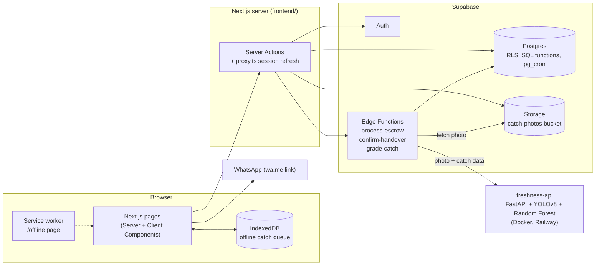

# ByCatch Loop

**Turning unwanted catch into opportunity.**

Small-scale Indonesian fishers (boats under 10 GT) regularly throw by-catch
(non-target fish) back into the sea, already dead, because nobody buys it at the
landing site and ice and hold space on board are limited. At the same time,
circular-economy businesses such as black soldier fly (BSF) maggot farms, fish
silage producers and liquid organic fertilizer makers struggle to find cheap,
steady animal-protein feedstock. ByCatch Loop is a web marketplace that
connects the two. A fisher logs a batch from their phone, even with no signal.
The system estimates its freshness from a photo, and buyers claim the batch
within a 48-hour window.

The app is in Indonesian (default), with a full English translation.

## Sustainable Development Goals

| SDG | Target | How ByCatch Loop contributes |
| --- | --- | --- |
| 14 Life Below Water | 14.b | Gives small-scale fishers a market entry point for by-catch that conventional buyers don't reach in time |
| 12 Responsible Consumption and Production | 12.3, 12.5 | Turns biomass that would be thrown away into feed and fertilizer feedstock |
| 2 Zero Hunger | 2.3 | An additional market channel for small-scale fishers, for catch that conventional buyers may not accept |
| 8 Decent Work and Economic Growth | 8.3 | A steadier supply for small downstream businesses (maggot, silage, fertilizer) |
| 13 Climate Action | 13.3 | Makes the effect of time, ice and storage on freshness visible, supporting awareness of post-harvest loss prevention |

## Features

**Fishers (nelayan)**
- Six-step catch wizard: category, estimated volume, time of haul, alive or dead, ice condition, and a photo (camera or upload).
- Works without signal. Catches logged offline are kept on the device (IndexedDB) and sent automatically when the connection returns.
- Freshness estimate from the photo and the catch details: a grade from `A1` to `B3`, with an explanation and a recommended downstream use.
- Publish a batch to the marketplace, with an optional price per kg. Each listing is open for 48 hours.
- "My Listings" to edit weight and price, cancel, or delete a batch, plus a transaction history where the fisher confirms handover with the final weight from the landing-site scale.

**Buyers (pembeli)**
- Registration with business type and buying preferences: material types, acceptable grades, preferred landing sites (PPI).
- Marketplace with search, grade and material filters, preferred PPIs listed first, sort by date, and a map of landing sites (Leaflet + OpenStreetMap). Picking a site on the map filters the list, and each batch shows its distance from the buyer's area.
- Batch detail with photo, grade, recommended uses and time left.
- "Buy" reserves the batch and opens WhatsApp to the fisher to arrange payment and pickup. The buyer then sets a pickup time, confirms receipt, or cancels.

**Both roles**
- In-app notifications built from listing and transaction events, with per-topic settings.
- Indonesian and English. The choice follows the account across devices.
- Profile photo with crop.
- Installable as a PWA, with an offline page for logging catches.

## Architecture



See [TECHNICAL_DOCS.md](TECHNICAL_DOCS.md) for the data model, the edge functions, the freshness model and the auth flow.

## Tech stack

| Layer | Technology |
| --- | --- |
| Frontend | Next.js 16 (App Router), React 19, TypeScript 5, Tailwind CSS 4, next-intl, Leaflet |
| Backend | Supabase: Postgres with Row Level Security, Auth, Storage, Deno Edge Functions, pg_cron |
| Freshness model | Python 3.11, FastAPI, Ultralytics YOLOv8n-cls, scikit-learn Random Forest |
| Hosting | Supabase Cloud, Railway (freshness API, Docker) |

Exact versions and what each piece is used for: [TECHNOLOGY.md](TECHNOLOGY.md).

## Quick start

```bash
git clone https://github.com/KzNck/Lomba-Ikan.git
cd Lomba-Ikan

# 1. Freshness API on port 8080 (keeps running; use a second terminal for step 3)
docker build -t freshness-api freshness-api
docker run -p 8080:8080 freshness-api

# 2. Supabase: run the SQL files, deploy the edge functions (see INSTALLATION.md)

# 3. Frontend on port 3000, from the repository root
cd frontend
npm install
cp .env.example .env.local   # fill in your Supabase URL and publishable key
npm run dev
```

The full step-by-step guide, including the Supabase setup and a smoke test, is in [INSTALLATION.md](INSTALLATION.md).

## Live demo

- Web app: https://lomba-ikan.vercel.app
- Freshness API: https://lombaikan-production.up.railway.app/docs (interactive API docs), health check at `/health`

## Repository structure

```text
Lomba-Ikan/
├── frontend/                 Next.js web app
│   ├── app/                  Routes (App Router), Server Actions, PWA manifest
│   ├── components/           UI by area: home, login, register, nelayan, pembeli, dashboard, pwa, ui
│   ├── lib/                  Data access (supabase/), freshness client, offline queue, i18n helpers, region data
│   ├── messages/             Translations: id.json (default), en.json
│   ├── i18n/                 next-intl locale selection and shared formats
│   ├── hooks/                Browser hooks (webcam)
│   ├── public/               Images, PWA icons, service worker (sw.js)
│   ├── scripts/              build-wilayah.mjs: regenerates the province, regency and port data
│   ├── types/                Database types
│   └── proxy.ts              Session refresh and login guard for protected routes
├── freshness-api/            FastAPI freshness-grading service
│   ├── app/                  Router, model pipeline, guardrail rules, response schema
│   ├── *.joblib, *.pt        Trained model files (loaded at startup)
│   └── Dockerfile
├── supabase/
│   ├── schema.sql            Tables, enums, RLS policies, triggers, SQL functions
│   ├── *.sql                 Storage bucket, expiry job, pickup confirmation, transaction and role locks
│   ├── functions/            Edge Functions: process-escrow, confirm-handover, grade-catch
│   └── email-templates/      Confirm-signup and reset-password emails
├── INSTALLATION.md
├── TECHNOLOGY.md
└── TECHNICAL_DOCS.md
```

## Competition and team

Built for the **International Web Technology Competition 2026**, organized by the
Faculty of Vocational Studies, Universitas Negeri Surabaya.

**Team:** “Nenek moyangku seorang pelaut”-Rico

| Role | Name |
| --- | --- |
| Backend Engineer | Nicola Adhi Pratama |
| AI Engineer | Sekar Bestari Nindita Yasmin |
| UI/UX Designer & Front-end Engineer | Zulfa Salsabila |
| UI/UX Designer & Front-end Engineer | Nathanael Rico Setiawan |

Institution: Department of Computer Engineering (Teknik Komputer), Faculty of Engineering, Universitas Diponegoro · Faculty advisor: _TBD_

## Acknowledgements

- Province and regency data: [cahyadsn/wilayah](https://github.com/cahyadsn/wilayah) (MIT), based on Kepmendagri No. 300.2.2-2138 of 2025.
- Fishing-port names and coordinates: Pusat Informasi Pelabuhan Perikanan, Ministry of Marine Affairs and Fisheries ([pipp.kkp.go.id](https://pipp.kkp.go.id)).
- Map tiles: © [OpenStreetMap](https://www.openstreetmap.org/copyright) contributors.
- SDG icons: [United Nations Sustainable Development Goals](https://www.un.org/sustainabledevelopment/news/communications-material/).
- Fonts: Geist, Inter, Poppins and Dancing Script, via Google Fonts.
- Freshness thresholds follow the Indonesian national standards SNI 01-2346-2006 (organoleptic scale) and SNI 2729:2013.

## License

_TBD_
