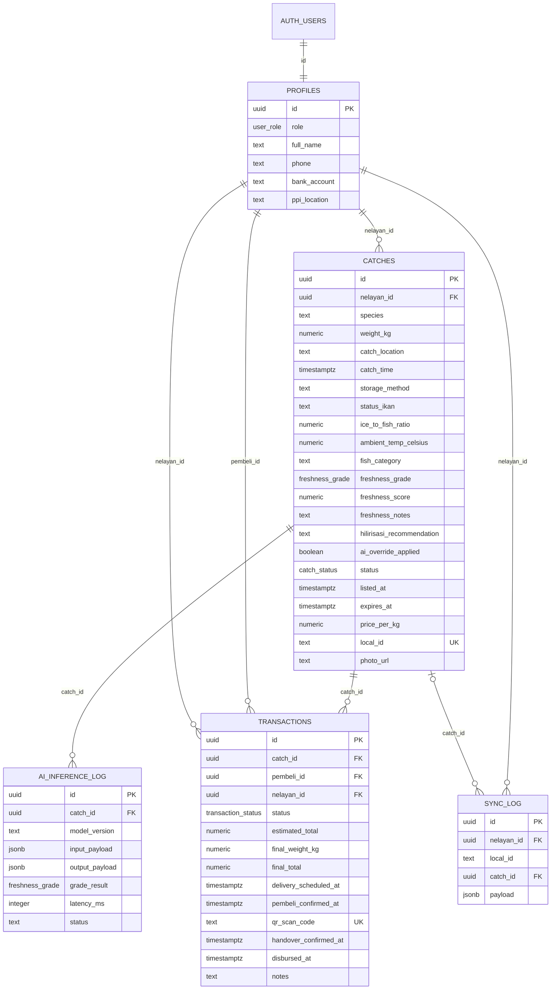
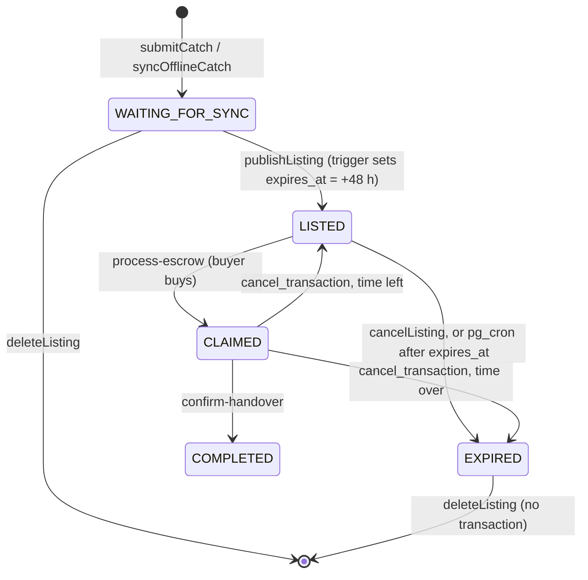
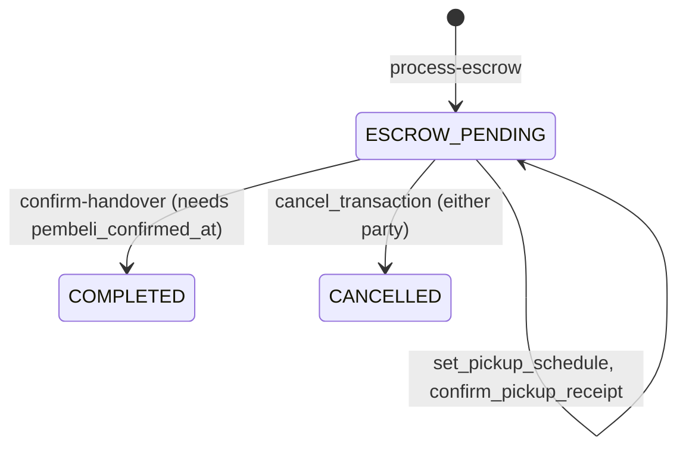
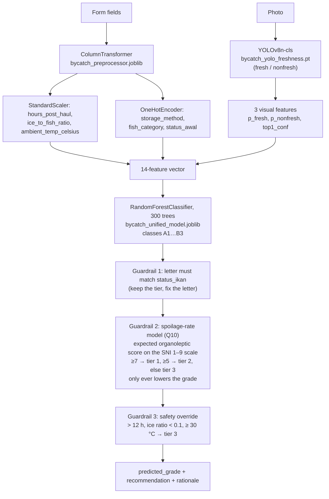
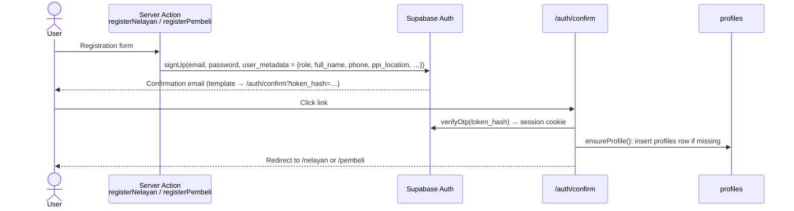

# Technical Documentation

How ByCatch Loop is built: the data model and access rules, the edge functions,
the freshness model, the frontend, auth, deployment and known limitations.
Setup steps are in [INSTALLATION.md](INSTALLATION.md). Versions and service
choices are in [TECHNOLOGY.md](TECHNOLOGY.md).

Names in `code` are the real identifiers in the repository. Indonesian terms used
throughout: *nelayan* = fisher, *pembeli* = buyer, *PPI* (Pangkalan Pendaratan
Ikan) = fish landing site, *hilirisasi* = downstream processing.

## Contents

1. [System overview](#1-system-overview)
2. [Data model](#2-data-model)
3. [Access control (RLS and SQL functions)](#3-access-control-rls-and-sql-functions)
4. [Edge functions](#4-edge-functions)
5. [Freshness API](#5-freshness-api)
6. [Frontend](#6-frontend)
7. [Authentication and authorization](#7-authentication-and-authorization)
8. [Security considerations](#8-security-considerations)
9. [Deployment](#9-deployment)
10. [Known limitations](#10-known-limitations)

## 1. System overview

| Part | Responsibility |
| --- | --- |
| `frontend/` (Next.js) | All UI. Reads data in Server Components and writes through Server Actions, always as the signed-in user, so Postgres RLS applies. Queues catches offline in IndexedDB. |
| `supabase/` SQL | Schema, RLS policies, triggers, and SQL functions for writes that need a caller check. A `pg_cron` job expires listings. |
| `supabase/functions/` | Three Deno edge functions for operations that write several rows or call the model. They use the service role, after checking the caller themselves. |
| `freshness-api/` (FastAPI) | Stateless grading service: photo + catch details in, grade out. It never touches the database. |

The frontend calls the edge functions with `supabase.functions.invoke()`, which
sends the user's JWT. Only `grade-catch` calls the freshness API, and only it
writes grades (section 6.4).

## 2. Data model

All tables are in the `public` schema. `profiles.id` is the Supabase Auth user id.



The diagram leaves out timestamps and a few logistics columns that the app never
writes (`vessel_name`, `synced_at`, `weighing_officer`, `handover_photo_url`, …).
See `supabase/schema.sql` for the full definitions.

### 2.1 Enums and constrained columns

| Type / column | Values |
| --- | --- |
| `user_role` | `nelayan`, `pembeli`, `admin` |
| `freshness_grade` | `A1`, `A2`, `A3`, `B1`, `B2`, `B3` |
| `catch_status` | `WAITING_FOR_SYNC`, `LISTED`, `CLAIMED`, `COMPLETED`, `EXPIRED` |
| `transaction_status` | `ESCROW_PENDING`, `ESCROW_HELD`, `DELIVERY_SCHEDULED`, `WEIGHING_DONE`, `RECONCILED`, `COMPLETED`, `CANCELLED` |
| `catches.storage_method` | `crushed_ice`, `chilled_seawater`, `ambient` |
| `catches.status_ikan` | `HIDUP` (alive), `MATI` (dead) |
| `catches.fish_category` | `campuran` (mixed), `teri_non_grade` (non-grade anchovy), `rucah` (trash fish) |
| `catches.ice_to_fish_ratio` | 0 to 1 |

The model's input fields (`storage_method` through `ambient_temp_celsius`) are
stored on the row, so a catch can be graded again later with exactly the same inputs.

### 2.2 Catch lifecycle



`WAITING_FOR_SYNC` is the default status of a new row. In practice it means
"saved, not yet published". When a cancelled transaction puts a batch back on the
marketplace, `cancel_transaction` restores the original `listed_at` and
`expires_at`, so a batch never gets a fresh 48 hours.

### 2.3 Transaction lifecycle



Pickup scheduling and receipt are recorded in columns, not statuses.
`ESCROW_HELD`, `DELIVERY_SCHEDULED`, `WEIGHING_DONE` and `RECONCILED` exist in the
enum, but no code path sets them.

### 2.4 Triggers and scheduled job

| Name | Table / schedule | Effect |
| --- | --- | --- |
| `trg_catch_expiry` → `set_catch_expiry()` | `catches` BEFORE UPDATE | When `status` becomes `LISTED`, sets `listed_at = now()` and `expires_at = now() + 48 h` |
| `trg_catches_updated_at`, `trg_transactions_updated_at` → `touch_updated_at()` | BEFORE UPDATE | Keeps `updated_at` current |
| `trg_transactions_require_buyer_confirmation` → `require_buyer_confirmation()` | `transactions` BEFORE UPDATE | Raises `buyer_not_confirmed` if a transaction becomes `COMPLETED` while `pembeli_confirmed_at` is null. This applies to the service role too. |
| `trg_catches_guard` → `guard_catch_write()` | `catches` BEFORE INSERT/UPDATE | For user sessions: new rows start as `WAITING_FOR_SYNC` with no grade; grade columns, model inputs and `catch_time` can't change; status moves only `WAITING_FOR_SYNC → LISTED` and `→ EXPIRED`; `listed_at`/`expires_at` come only from `trg_catch_expiry`. Raises `catch_field_locked` or `catch_status_locked`. |
| `trg_profiles_keep_role` → `keep_profile_role()` | `profiles` BEFORE UPDATE | Raises `role_locked` if `role` changes in a user session |
| `expire-overdue-listings` (pg_cron) | `*/5 * * * *` | `expire_overdue_listings()` marks `LISTED` rows past `expires_at` as `EXPIRED` |

The app doesn't wait for the cron job: `isOverdue()` in `lib/supabase/catches.ts`
already hides overdue listings from the marketplace and shows them as expired to the fisher.

## 3. Access control (RLS and SQL functions)

RLS is on for every table. The frontend only ever uses the publishable key plus
the user's session, so these policies decide what each user can read and write.

| Table | Policy | Operation | Rule |
| --- | --- | --- | --- |
| `profiles` | `profiles: self read` | SELECT | Own row |
| | `profiles: self insert` | INSERT | Own row, `role` is `nelayan` or `pembeli` |
| | `profiles: self update` | UPDATE | Own row (the role itself is guarded by `trg_profiles_keep_role`) |
| `catches` | `catches: nelayan owns` | ALL | `nelayan_id = auth.uid()` |
| | `catches: pembeli view listed` | SELECT | `status = 'LISTED'` and the caller's role is `pembeli` |
| | `catches: pembeli view purchased` | SELECT | The caller has a transaction for this catch |
| `transactions` | `transactions: parties read` | SELECT | Caller is `nelayan_id` or `pembeli_id`. There are no write policies: every change goes through the functions below or an edge function. |
| `ai_inference_log` | `ai_log: nelayan view own` | SELECT | The catch belongs to the caller. Rows are written by `grade-catch`. |
| `sync_log` | `sync_log: nelayan own` | ALL | `nelayan_id = auth.uid()` |
| `storage.objects` (`catch-photos`) | `catch photos: public read` | SELECT | Anyone |
| | `catch photos: owner upload / update / delete` | INSERT / UPDATE / DELETE | First path segment equals `auth.uid()` |

`catches: nelayan owns` lets a fisher manage their own rows, and the
`trg_catches_guard` trigger (section 2.4) limits which columns and status
changes that covers. Grades, claims and completions happen only in the edge
functions and SQL functions.

Profiles are private, so a buyer can't read a fisher's profile directly. The
functions below return exactly the data one party of a transaction needs.

| Function (RPC) | Callable by | Behaviour |
| --- | --- | --- |
| `get_transaction_contact(p_transaction_id)` | `authenticated` | Returns the other party's `full_name` and `phone`, only to the transaction's fisher or buyer. Used for the WhatsApp link. |
| `cancel_transaction(p_transaction_id)` | `authenticated` | Either party. Sets the transaction to `CANCELLED` and `notes = 'cancelled_by:<role>'`. Relists the catch with its original deadline, or marks it `EXPIRED`. Returns `relisted`, `expired` or `cancelled`. Raises `not_found` or `not_in_progress`. |
| `set_pickup_schedule(p_transaction_id, p_at)` | `authenticated` | Buyer only, open transactions only. `p_at` must be between 1 hour ago and 7 days ahead (`schedule_out_of_range`). |
| `confirm_pickup_receipt(p_transaction_id)` | `authenticated` | Buyer only. Sets `pembeli_confirmed_at` once. Calling it again keeps the first time. |
| `expire_overdue_listings()` | Nobody (revoked from every client role) | Called by pg_cron |

All of these are `SECURITY DEFINER` with a fixed `search_path = public`, and each one
checks `auth.uid()` itself.

## 4. Edge functions

All three are deployed with JWT verification on, so the Supabase gateway rejects
requests without a valid user token. Each function reads the caller from that
token, then uses a service-role client and enforces its own ownership checks.
Responses are JSON. Errors have the shape `{"message": "..."}`, with Indonesian
messages.

### 4.1 `process-escrow`: claim a batch

Called by `claimCatch()` in `lib/supabase/transactions.ts`, from the `buyBatch` Server Action.

| | |
| --- | --- |
| Request | `{ "catch_id": uuid }` |
| Checks | Caller's profile role is `pembeli` (403), catch exists (404), `status = 'LISTED'` (409), `expires_at` not passed (409) |
| Writes | One conditional update, `status = 'CLAIMED' WHERE status = 'LISTED' AND expires_at > now()`, so only one of two simultaneous buyers wins (the other gets 409). Then it inserts `transactions`: `ESCROW_PENDING`, `estimated_total = weight_kg × price_per_kg` computed from the catch row, `qr_scan_code = crypto.randomUUID()`, `ppi_location = catches.catch_location`. If the insert fails, the catch goes back to `LISTED` with its original deadline. |
| Response 200 | The new `transactions` row |
| Errors | 401 no or invalid token, 403, 404, 409, 500 |

### 4.2 `confirm-handover`: complete a transaction

Called by `confirmHandover()` in `lib/supabase/transactions.ts`, from the fisher's
"Confirm handover" form. The Server Action reads `qr_scan_code` from the
transaction row and sends it. Nobody scans anything.

| | |
| --- | --- |
| Request | `{ "qr_scan_code": string, "final_weight_kg": number > 0 }` |
| Checks | Weight is a positive number (400), the code matches a transaction (404), caller is its fisher (403), not already `COMPLETED` or `CANCELLED` (409). The database trigger also requires `pembeli_confirmed_at`. The Server Action checks this first and shows "Waiting for the buyer…". |
| Writes | Transaction: `status = 'COMPLETED'`, `final_weight_kg`, `final_total = final_weight_kg × price_per_kg`, and `weighing_done_at`, `handover_confirmed_at`, `disbursed_at` = now. Catch: `status = 'COMPLETED'`. |
| Response 200 | The updated `transactions` row |
| Errors | 400, 401, 403, 404, 409, 500 |

`disbursed_at` is a timestamp only. No payment is made (see section 10).

### 4.3 `grade-catch`: grade a catch photo

Called by `gradeCatch()` in `lib/freshness/grade.ts`, right after a catch is
recorded (online or from the offline queue) and from "Grade again" on the result
page. It is the only writer of grade columns: `trg_catches_guard` blocks them
for user sessions.

| | |
| --- | --- |
| Request | JSON `{ "catch_id": uuid }` to grade the stored photo (`photo_url`), or `multipart/form-data` with `catch_id` and `photo` for a photo that wasn't stored (HEIC the browser couldn't convert) |
| Secret | `FRESHNESS_API_URL` (500 if unset) |
| Checks | Caller owns the catch (404), catch not graded yet (409), a photo is available (400), a stored photo can be fetched (502) |
| Calls | `POST {FRESHNESS_API_URL}/api/v1/predict`, multipart: the photo plus `status_ikan`, `hours_post_haul` (recomputed from `catch_time`, minimum 1), `ice_to_fish_ratio`, `ambient_temp_celsius`, `storage_method`, `fish_category` |
| Writes | `catches.freshness_grade`, `freshness_score` (= `round(confidence_score × 100)`), `freshness_notes` (= rationale), `hilirisasi_recommendation`, `ai_override_applied`. One `ai_inference_log` row per call, with status `success` or `error`, input, output and latency. |
| Response 200 | `{ "grade": "B1", "score": 87 }` |
| Errors | 400, 401, 404, 409, 500, 502 (photo fetch or API failure) |

## 5. Freshness API

FastAPI app in `freshness-api/app/`. The three model files load once when the
process starts (`predictor = FreshnessPredictor()`). The service is stateless.

### 5.1 Endpoints

| Method | Path | Description |
| --- | --- | --- |
| `GET` | `/health` | `{"status": "ok"}` |
| `POST` | `/api/v1/predict` | Grade one catch (below) |
| `GET` | `/docs`, `/openapi.json` | Generated by FastAPI |

### 5.2 `POST /api/v1/predict`

Request: `multipart/form-data`.

| Field | Type | Allowed values |
| --- | --- | --- |
| `catch_id` | string | Echoed back |
| `status_ikan` | string | `HIDUP`, `MATI` (otherwise 422) |
| `hours_post_haul` | float | Hours since the net was hauled |
| `ice_to_fish_ratio` | float | 0–1 |
| `ambient_temp_celsius` | float | °C |
| `storage_method` | string | `crushed_ice`, `chilled_seawater`, `ambient` |
| `fish_category` | string | `campuran`, `teri_non_grade`, `rucah` |
| `photo` | file | JPG, PNG, WebP, HEIC (otherwise 422) |

Response (`FreshnessResult` in `app/models/schemas.py`). A real call with the request from INSTALLATION.md §4 (dead catch, 6 hours, a little ice, 30 °C):

```json
{
  "catch_id": "test",
  "predicted_grade": "B2",
  "confidence_score": 0.5564,
  "hilirisasi_recommendation": "Budidaya larva maggot BSF (dekomposisi sedang, tidak layak jadi tepung ikan).",
  "override_applied": true,
  "rationale": "Berdasarkan hours_post_haul=6.0 jam, ambient_temp_celsius=30.0°C, ice_to_fish_ratio=0.50, storage_method=chilled_seawater, model kinetika memperkirakan skor organoleptik ~6.5/9 (tier 2) -- lebih rendah dari prediksi model (B1, tier 1); grade diturunkan ke B2.",
  "model_version": "bycatch-unified-rf-v1"
}
```

Here the Random Forest predicted `B1`, and guardrail 2 lowered it to `B2`
because the expected organoleptic score after 6 hours was about 6.5/9.
`rationale` and `hilirisasi_recommendation` are in Indonesian. `model_version`
identifies the build that answered. The code in this repository reports
`bycatch-unified-rf-yolo-v2`.

Errors: 422 for invalid input or an unreadable photo, 500 if
prediction fails.

### 5.3 What the model predicts

The grade combines two things:

- **Letter:** the fish's state when caught. `A` = alive, `B` = dead.
- **Number:** the severity tier. 1 = best, 3 = worst.

| Grade | Recommended use (`HILIRISASI_MAP`, translated) |
| --- | --- |
| A1 | Release back to the sea, or fresh silage (fish still vital, prime quality) |
| A2 | Wet feed or fresh silage (vitality declining) |
| A3 | Emergency fresh silage or low-grade wet feed (almost dead) |
| B1 | Fish silage or raw material for fish meal (minimal decomposition) |
| B2 | Black soldier fly larvae (maggot) farming (moderate decomposition) |
| B3 | Liquid organic fertilizer (advanced decomposition) |

The recommendations deliberately leave out human consumption: the grade is an
indicative estimate, not a food-quality certification.

### 5.4 Pipeline



Details, checked against the code and the model files:

- `status_ikan` is renamed `status_awal` before preprocessing, to match the training data.
- **Guardrail 2:** the expected score is `9 · exp(−k · hours / 9)`. The decay rate `k`
  comes from a Q10 = 2 temperature factor around 30 °C
  (`K_BASE_CALIBRATED = 0.3383`), divided by an ice-protection factor built from
  the ice ratio and storage method. The thresholds follow SNI 01-2346-2006
  (organoleptic scale) and SNI 2729:2013.
- If any guardrail changes the grade, `override_applied` is `true` and `rationale`
  lists every correction. Otherwise the rationale describes the model's prediction.
- `confidence_score` is the Random Forest's probability for its top class, taken
  before the guardrails run.

### 5.5 How the wizard answers become model inputs

The fisher answers in everyday terms. `lib/catches/model-inputs.ts` is the one
place that translates the answers into the model's vocabulary.

| Wizard step | Answer | Model input |
| --- | --- | --- |
| Category | Mixed / Anchovy / anything else (shrimp, squid, small pelagic, demersal, crab, other) | `fish_category`: `campuran` / `teri_non_grade` / `rucah` |
| Time of haul | Morning / Midday / Afternoon / Last night | `hours_post_haul` = current hour − 6 / − 12 / − 16 / + 8 (minimum 1) |
| Condition | Alive / Dead | `status_ikan`: `HIDUP` / `MATI` |
| Ice | Plenty / A little / None | `storage_method` `crushed_ice` / `chilled_seawater` / `ambient`, and `ice_to_fish_ratio` 1.0 / 0.5 / 0.0 |
| (not asked) | – | `ambient_temp_celsius` = 30 |

## 6. Frontend

### 6.1 Routes

| Route | Access | Purpose |
| --- | --- | --- |
| `/` | Public | Landing page (problem, how it works, impact targets, SDGs) |
| `/auth/login` | Public | Email + password sign-in |
| `/auth/choose-role` | Public | Pick fisher or buyer |
| `/auth/register/nelayan`, `/auth/register/pembeli` | Public | Registration forms |
| `/auth/daftar/konfirmasi` | Public | "Check your email", with resend |
| `/auth/confirm` | Route handler | Exchanges an email link (`token_hash` or PKCE `code`) for a session, creates the profile, redirects by role |
| `/auth/lupa-password`, `/auth/atur-password` | Public / session | Request a reset link, set a new password |
| `/nelayan` | Fisher | Dashboard: summary, active listings, quick actions |
| `/nelayan/catat` | Fisher | "Add Catch" wizard, shown as a modal over the dashboard |
| `/nelayan/catat/hasil` | Fisher | Freshness result, recommended uses, publish |
| `/nelayan/listing` | Fisher | My Listings: filter, edit, cancel, delete |
| `/nelayan/riwayat` | Fisher | Transaction history, handover confirmation |
| `/nelayan/akun`, `/nelayan/akun/notifikasi` | Fisher | Account, notification settings |
| `/pembeli` | Buyer | Dashboard: recommended batches, activity summary |
| `/marketplace`, `/marketplace/[slug]` | Buyer | Marketplace list and map; batch detail (`slug` = catch id) |
| `/pembeli/riwayat` | Buyer | Purchase history: pickup time, receipt confirmation, cancel |
| `/pembeli/akun`, `/pembeli/akun/preferensi`, `/pembeli/akun/notifikasi` | Buyer | Account, buying preferences, notification settings |
| `/offline` | Public | Served by the service worker when there's no signal. Can queue a catch. |
| `/manifest.webmanifest` | Public | PWA manifest (`app/manifest.ts`) |

### 6.2 Code layout

| Folder | Contents |
| --- | --- |
| `app/` | Routes, layouts (`loading.tsx` skeletons), Server Actions (`app/**/actions.ts`, `app/*-actions.ts`) |
| `components/<area>/` | UI grouped by area. Each area keeps its copy and constants in `*-content.ts` files next to the components. |
| `lib/supabase/` | Every database, Storage and edge function call, plus auth helpers and caching |
| `lib/catches/`, `lib/marketplace/`, `lib/nelayan/`, `lib/pembeli/` | Turning database rows into view data (grades, labels, batches, dashboards) |
| `lib/freshness/` | Direct API client (`client.ts`) and the `grade-catch` call (`grade.ts`) |
| `lib/offline/storage.ts` | IndexedDB queue (`bycatch-offline` database, `catches` store) |
| `lib/wilayah/` | Province, regency and port data, with coordinates |
| `messages/` | `id.json`, `en.json` |

### 6.3 Data fetching and mutations

- **Reads.** Server Components call functions in `lib/supabase/*` with a
  cookie-based server client. Pages read on almost every dashboard go through
  `cachedForUser()` (`lib/supabase/cached.ts`). It wraps `unstable_cache` with a
  key that includes the verified user id, and tags like `catches:<userId>`,
  `transactions:<userId>` and `marketplace`. RLS still applies, because the cached
  function runs with the user's own access token.
- **Writes.** Every change is a Server Action. Each one checks the session and
  role (`requireProfile`), writes, then calls `expireTags(...)` for the affected
  users (including the other party of a transaction) and `revalidatePath(...)`.
  Forms use `useActionState` for validation errors.
- **Client router cache.** `staleTimes: { dynamic: 30, static: 60 }` in
  `next.config.ts` keeps visited pages for a short time, so back-navigation is instant.
- **No client-side data library.** There's no React Query or SWR, and the browser
  never talks to Supabase directly.

### 6.4 Catch logging, offline and grading

1. The browser shrinks the photo to a JPEG with a longest edge of 1600 px
   (`lib/photo/prepare-upload.ts`). Server Actions accept up to 4 MB.
2. Online, the wizard posts to `submitCatch`. It inserts the row, uploads the photo to
   `catch-photos/<userId>/<catchId>.jpg`, and calls `grade-catch`. A photo
   that wasn't stored (HEIC from Chrome) goes inside that request instead. The
   row is saved before grading, so a grading failure never loses the catch: it
   stays "Not graded yet", and "Grade again" retries.
3. Offline, the wizard stores the answers, the computed catch time and the photo
   in IndexedDB. `components/nelayan/offline-sync.tsx` sends the queue through
   `syncOfflineCatch` when the browser comes back online. `local_id` (unique in
   `catches`) makes a resend return the existing row instead of creating a duplicate.
4. The service worker (`public/sw.js`, production builds only) caches only the
   `/offline` page, its build assets, the category images and an icon. It
   never caches per-user pages, so nothing from one account stays on a shared device.

### 6.5 Internationalization

`next-intl` with locales `id` (default) and `en`. The locale lives in the
`NEXT_LOCALE` cookie, so URLs have no locale prefix. The choice is also saved to
`user_metadata.locale`, so it follows the account to other devices. Times are
rendered in `Asia/Jakarta`. Money uses a shared `rupiah` format. The WhatsApp
message a buyer sends is always in Indonesian, because it goes to the fisher.

### 6.6 Notifications

There's no notifications table. `lib/notifications.ts` builds the bell dropdown
from events already recorded in `catches` and `transactions`. Each user picks which
topics appear (`/…/akun/notifikasi`, topics in `lib/notification-topics.ts`):

- Buyers: `newListings` (listings that match their preferences) and `orders`
  (claimed, completed, cancelled).
- Fishers: `sales` (claimed, pickup scheduled, received, sold, cancelled) and
  `listings` (live, ending soon, ended).
"Last seen" is a per-account cookie. There are no push or email notifications.

## 7. Authentication and authorization



- Registration data waits in `user_metadata` until the account is confirmed.
  The `profiles` row is created on first confirmation or first login
  (`ensureProfile` in `lib/supabase/auth.ts`). Buyer details that have no column
  (business name, business type, preferences) stay in `user_metadata`.
- Passwords are at least 8 characters (`MIN_PASSWORD_LENGTH`). The post-login
  `?next=` target is limited to internal paths (`safeNext`).

Where each rule is enforced:

| Layer | What it enforces |
| --- | --- |
| `proxy.ts` → `updateSession()` | Refreshes the session cookie. Verifies the token with `getClaims()`. Redirects signed-out users away from `/nelayan`, `/pembeli` and `/marketplace`. |
| Layouts (`app/nelayan/layout.tsx`, `app/pembeli/layout.tsx`, reused by `/marketplace`) | `requireProfile(role)`: a signed-in user with the wrong role is sent to their own dashboard |
| Server Actions | Call `requireProfile(role)` again, and re-check ownership and state before writing. For example, `buyBatch` re-reads the catch, and `confirmHandover` checks the caller is the transaction's fisher. |
| Postgres RLS and SQL functions | Final authority on every row read or written with a user session (section 3) |
| Edge functions | Verify the JWT, then check ownership or party membership before using the service role |

Hiding a button in the UI is only for convenience. Every rule above also
applies on the server.

## 8. Security considerations

- **Roles are assigned on the server.** A new profile can only be `nelayan` or
  `pembeli`. The app accepts only these two values from registration data, and
  the database enforces the same rule with an RLS insert check. After the profile
  exists, a database trigger blocks role changes from user sessions. `admin` can
  only be granted from the SQL Editor or with the service role.
- **Grades and catch status can't be set by hand.** A database trigger stops
  user sessions from writing grade columns, changing the model inputs after a
  catch is recorded, extending a listing's deadline, or moving a catch to
  `CLAIMED` or `COMPLETED`. Only `grade-catch` writes grades, one per catch.
- **Claims and completions are checked on the server.** `process-escrow`
  accepts only buyer accounts, computes the total from the catch row, and claims
  with a single conditional update, so a batch can't be claimed twice.
  `confirm-handover` accepts only the transaction's fisher.
- **No privileged key reaches the browser.** The frontend uses the publishable
  key and the user's session. The service-role key exists only inside edge functions.
- **Least-privilege data access.** Profiles are private. Contact details are
  shared only between the two parties of a transaction, and only name and phone
  (`get_transaction_contact`). Transactions are read-only to clients.
- **Caller checks in privileged code.** Every `SECURITY DEFINER` function and
  edge function checks `auth.uid()` or the JWT subject before acting.
- **Uploads are confined.** Users can write only under their own folder in
  `catch-photos`. Photos are public-read by design, so listings can show them.
- **Redirects are validated.** `safeNext()` rejects external and
  protocol-relative targets. Email-link handling strips tokens from the
  redirect URL so they don't leak via `Referer`.
- **Offline data is minimal.** The service worker never caches per-user pages.
  The offline queue holds only unsent catches.

## 9. Deployment

| Part | Where | How |
| --- | --- | --- |
| Database, Auth, Storage, Edge Functions | Supabase Cloud | SQL run in the SQL Editor, in the order in INSTALLATION.md. Functions deployed with `supabase functions deploy`. `FRESHNESS_API_URL` set with `supabase secrets set`. |
| Freshness API | Railway, from `freshness-api/Dockerfile` (`python:3.11-slim`, non-root user, port 8080) | Live at `https://lombaikan-production.up.railway.app` |
| Frontend | Vercel | Live at `https://lomba-ikan.vercel.app`. `next.config.ts` sizes the Server Action body limit (4 MB) to fit under Vercel's 4.5 MB request limit. Needs the env vars from INSTALLATION.md §5, and the domain in Supabase's Site URL / redirect URLs. |

There's no CI/CD pipeline in the repository. Deploys are manual. Checks run
locally: `npm run lint`, `npx tsc --noEmit`, `npm run build`.

## 10. Known limitations

- **No payment processing.** "Escrow" is a naming leftover. `process-escrow`
  reserves the batch, and payment happens directly between buyer and fisher on
  WhatsApp. `confirm-handover` records `disbursed_at` as a timestamp only.
  `profiles.bank_account` is collected but not used for payouts.
- **The QR code isn't scanned.** Each transaction gets a random `qr_scan_code`,
  but the fisher's handover form reads it from the row. There's no QR display or
  camera scan yet.
- **Some model inputs are approximations.** `ambient_temp_celsius` is always 30 °C.
  `hours_post_haul` comes from a coarse time-of-day answer. Categories other than
  mixed and anchovy all map to `rucah`. The YOLO stage only distinguishes fresh
  from non-fresh.
- **scikit-learn version mismatch.** The model was saved with scikit-learn 1.6.1
  and `requirements.txt` pins 1.5.2. It loads and predicts, with a version warning at startup.
- **Unused schema parts.** Four `transaction_status` values, `sync_log`
  (deduplication uses `catches.local_id`), `vessel_name` (always `'-'`, the
  wizard doesn't ask), `weighing_officer`, `handover_photo_url` and the Realtime
  publication on `catches` and `transactions` (the app doesn't subscribe) are all
  defined but not used.
- **One photo per catch** (`photo_url`). The detail view's carousel shows one image.
- **Distances are approximate.** Distance to a landing site is measured from the
  centre of the buyer's regency or city, not their exact address.
- **In-app notifications only.** No push or email alerts for new listings or claims.
- **Landing-page impact figures are pilot targets.** The 3,000 kg/month, ≥70%
  closing rate and <90 minutes numbers are hard-coded targets, not measured
  results. The app doesn't compute an emissions estimate.
- **No `admin` interface.** The role exists, but there are no admin pages.
- **No automated tests or CI.**
