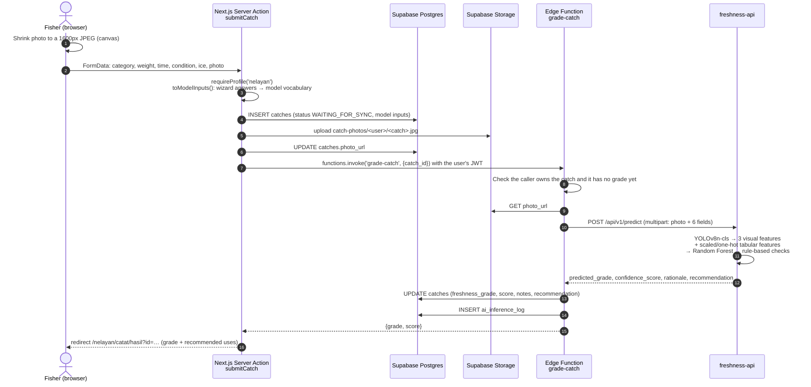
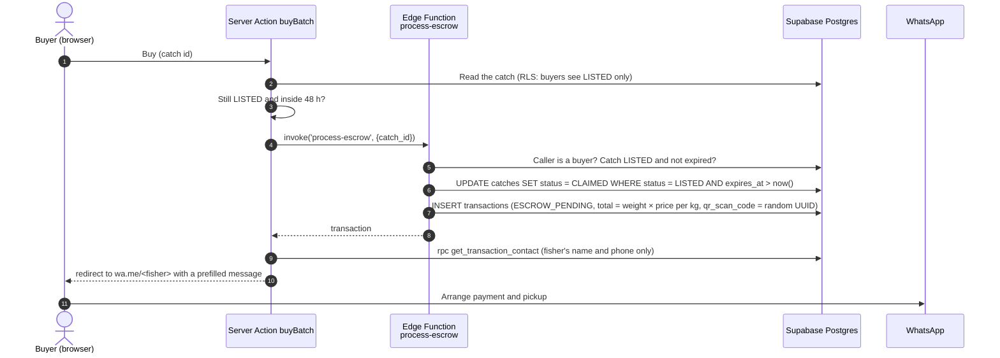

# Technology

Versions below come from `frontend/package-lock.json`, `freshness-api/requirements.txt`,
`freshness-api/Dockerfile` and the edge function imports.

## Stack by layer

### Frontend (`frontend/`)

| Technology | Version | Role in this project |
| --- | --- | --- |
| Next.js (App Router) | 16.3.5 | Pages are Server Components that read data on the server. Every write is a Server Action. `proxy.ts` refreshes the Supabase session on each request and sends signed-out users to the login page. |
| React | 19.2.8 | UI. Form state uses `useActionState` with Server Actions. |
| TypeScript | 5.9.3 | Strict mode. Database row types are in `types/database.ts`. |
| Tailwind CSS | 4.3.3 (via `@tailwindcss/postcss`) | Styling. No `tailwind.config`: tokens live in `app/globals.css`. |
| next-intl | 4.14.5 | English (default) and Indonesian. The locale is kept in a cookie, not the URL. Shared formats for rupiah, weights and dates, all in the Asia/Jakarta time zone. |
| @supabase/ssr | 0.12.7 | Cookie-based Supabase sessions in Server Components, Server Actions and the proxy |
| @supabase/supabase-js | 2.116.0 | Queries, Storage uploads, RPC calls and edge function calls |
| Leaflet / react-leaflet | 1.9.4 / 5.0.0 | Landing-site (PPI) maps in the marketplace and batch detail |
| ESLint | 9.39.5 with `eslint-config-next` 16.3.5 | Linting (`npm run lint`) |
| Browser APIs | – | IndexedDB (offline catch queue), Service Worker (offline page), `getUserMedia` (in-app camera), Canvas (photo downscaling and avatar crop) |

### Freshness model service (`freshness-api/`)

| Technology | Version | Role in this project |
| --- | --- | --- |
| Python | 3.11 (`python:3.11-slim` base image) | Runtime |
| FastAPI | 0.115.0 | HTTP API with `/api/v1/predict` and `/health`, plus auto-generated OpenAPI docs |
| Uvicorn | 0.30.6 | ASGI server |
| Pydantic | 2.9.2 | Response schema (`FreshnessResult`) |
| python-multipart | 0.0.12 | Multipart form parsing for the photo upload |
| Ultralytics | 8.4.157 | Runs the YOLOv8n classification model (`bycatch_yolo_freshness.pt`, fresh vs. non-fresh) |
| PyTorch | CPU build, version resolved by Ultralytics | Backend for YOLO. Installed from the PyTorch CPU index, so no GPU is needed. |
| scikit-learn | 1.5.2 | Loads the `ColumnTransformer` preprocessor and the 300-tree `RandomForestClassifier` |
| joblib | 1.4.2 | Loads the saved scikit-learn objects |
| pandas / NumPy | 2.2.3 / 1.26.4 | Builds the feature row for the model |
| Pillow / pillow-heif | 10.4.0 / 0.18.0 | Reads uploaded photos, including HEIC from iPhones |
| SciPy | 1.13.1 | Listed in `requirements.txt`; not imported by the app code |

### Backend (`supabase/`)

| Technology | Role in this project |
| --- | --- |
| Supabase Postgres | Tables, enums, triggers, and SQL functions for the operations that need a caller check: cancelling, pickup scheduling, receipt confirmation, contact lookup |
| Row Level Security | Controls which rows each user sees and changes. The frontend uses the user's own session, not a privileged key, so RLS applies to every query it makes. |
| Supabase Auth | Email and password accounts, email confirmation, password reset. Session tokens are verified locally in the app with `getClaims()` (asymmetric signing keys). |
| Supabase Storage | Public `catch-photos` bucket for catch photos and profile photos. Each user writes only to their own folder. |
| Supabase Edge Functions (Deno) | `process-escrow`, `confirm-handover`, `grade-catch`: operations that write to more than one table or call the freshness API, using the service role after checking the caller. They import `@supabase/supabase-js@2` from esm.sh, and Deno std 0.208.0 for `crypto.randomUUID`. |
| pg_cron | Marks overdue listings `EXPIRED` every 5 minutes |

## Why these choices

- **Supabase** puts Postgres, auth, file storage and serverless functions in one
  hosted project. A small team can enforce access rules in the database with RLS
  instead of building a separate API server.
- **Next.js Server Components and Server Actions** keep data fetching and writes
  on the server. The browser gets HTML and never holds a privileged key.
  `unstable_cache` with per-user tags plus `revalidatePath` keep dashboards fast
  without showing stale data after a user's own change.
- **A separate Python service** for the model, because the model was trained in
  Python (scikit-learn + Ultralytics). The model files run as they were exported
  from the training notebook, with no conversion step.
- **Offline-first catch logging** (IndexedDB + service worker), because fishers
  often log catches at sea or at the dock with weak or no signal.
- **Cookie-based i18n, English by default with a full Indonesian translation.**
  The primary users are Indonesian fishers and buyers, so every screen exists in
  Indonesian. A user's choice is saved to their account and follows them to other
  devices. Messages sent to fishers on WhatsApp are always in Indonesian.
- **WhatsApp handoff after purchase**, because it's how both sides already
  arrange payment and pickup. The app records the reservation and the handover,
  but doesn't process payments.

## Third-party services

| Service | Used for | Where it's configured |
| --- | --- | --- |
| [Supabase](https://supabase.com) | Database, Auth, Storage, Edge Functions, cron | `frontend/.env.local`; SQL in `supabase/`; `supabase secrets` for edge functions |
| [Railway](https://railway.app) | Hosts the freshness API container (built from `freshness-api/Dockerfile`) | `FRESHNESS_API_URL` edge function secret |
| [OpenStreetMap](https://www.openstreetmap.org) tile server | Map tiles | `frontend/components/pembeli/marketplace-content.ts` |
| WhatsApp (`wa.me` links) | Buyer–fisher contact after a purchase | `frontend/lib/contact/` |
| Google Fonts (via `next/font`) | Geist, Geist Mono, Inter, Poppins, Dancing Script, served from the app's own domain at build time | `frontend/app/layout.tsx` |

Static data sources (downloaded by `frontend/scripts/build-wilayah.mjs` and stored in
`frontend/lib/wilayah/`, no runtime calls):

- 38 provinces and 514 regencies/cities, with centre points: [cahyadsn/wilayah](https://github.com/cahyadsn/wilayah) (MIT)
- 686 fishing ports with coordinates: KKP Pusat Informasi Pelabuhan Perikanan ([pipp.kkp.go.id](https://pipp.kkp.go.id))

## Data flow: logging and grading a catch

The most involved request in the system: a fisher finishes the catch wizard and gets a freshness grade.

`grade-catch` is the only component that writes a grade: a database trigger
blocks those columns for user sessions. A photo the browser can't turn into a
JPEG (HEIC in Chrome) isn't stored, so it is sent inside the `grade-catch`
request instead of being fetched from Storage. If grading fails, the catch stays
saved as "Not graded yet", and the fisher can retry with "Grade again".

If the device is offline at step 2, the wizard saves the answers and photo to
IndexedDB instead. When the connection returns, `components/nelayan/offline-sync.tsx`
sends each queued catch to the `syncOfflineCatch` Server Action, which follows the
same path. The `local_id` sent with each catch makes retries idempotent.

## Data flow: buying a batch

The rest of the transaction: the buyer sets a pickup time (`set_pickup_schedule`)
and confirms receipt (`confirm_pickup_receipt`). The fisher then enters the final
weight, and `confirm-handover` marks the transaction and the catch `COMPLETED`.
Either side can cancel before that (`cancel_transaction`), which puts the batch
back on the marketplace if its original 48 hours haven't run out.
